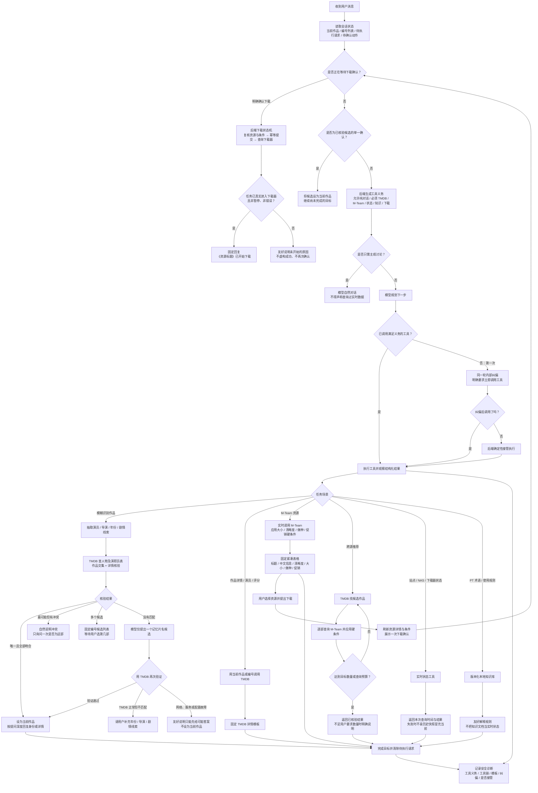

# 影视中枢 Agent 任务执行流程

## 会话状态原则

- “当前作品”只能来自 TMDB 核验结果，或用户从已核验候选中明确选择的作品。
- “待执行请求”最多保留最近一个未完成的只读目标；“是的、查、继续”会承接它。
- 下载确认使用独立、较短时效的状态，不与普通查询确认混用。
- 模型记忆只能提出待核验片名，不能提供演员、评分、资源、状态或下载结果等事实。
- 工具结果使用后端固定模板；网页与手机端共享同一份回复内容和执行链路。
